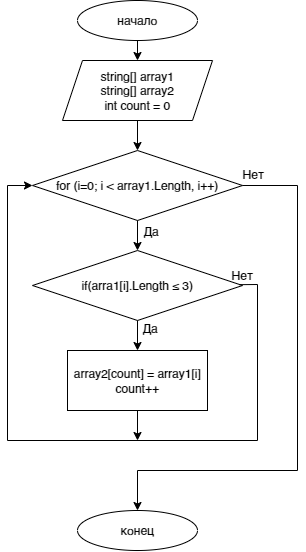

# final_work

## Описание задачи

Написать программу, которая из имеющегося массива строк формирует массив из строк, длина которых меньше либо равна 3 символа. Первоначальный массив можно ввести с клавиатуры, либо задать на старте выполнения алгоритма. При решении не рекомендуется пользоваться коллекциями, лучше обойтись исключительно массивами.

## Предлагаемое решение
Задача решается с помощью метода SearchElements. Вначале пользователем задаётся массив array1, также объявляется массив array2 такой же длины. В методе SearchElements проверяется длина каждого элемента массива, введенного пользователем (с помощью цикла for). Если длина рассматриваемого элемента(строки) массива меньше трёх символов, то этот элемент(строка) записывается в массив array2. Таким образом, в массив array2 записываются только те значения, которые соответствуют условию. Метод PrintArray предназначен для вывода массива на экран. В конечном итоге мы выводим готовый массив array2 на экран.

